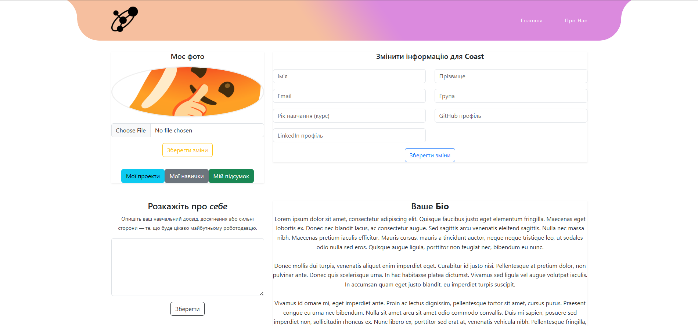
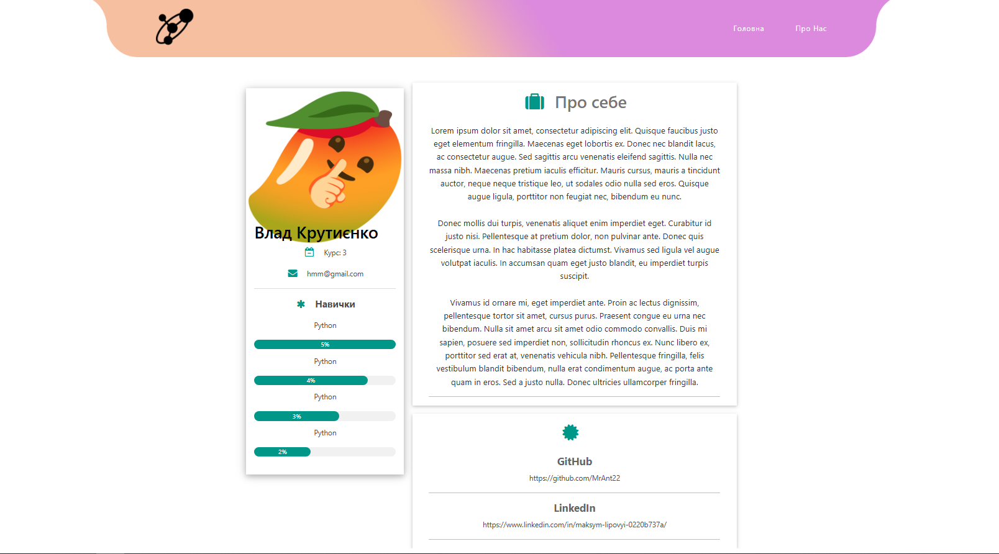
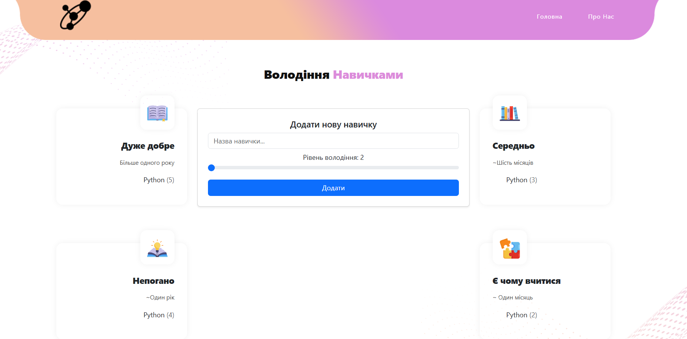

# Students-portfolio

## About

Student's portfolio - an open source project built on Django + React stack that allows you to make your portfolio and share it with other students and more.

## Preview







## Building

First, create a virtual environment for the project.

```bash
python -m venv venv
```

And activate it:

```bash
venv\Scripts\activate
```

Then, install all needed dependencies by running:

```bash
pip install -r requirements.txt
```

Set up DB Server from `backend\crud\settings.py`

Start your server inside virtual enviroment:

```bash
(venv) Students portfolio\backend>python manage.py runserver
```

Create another terminal and run React:

```bash
Students portfolio\frontend>npm start
```

Create superuser:

```bash
(venv) \backend\manage.py createsuperuser
```
